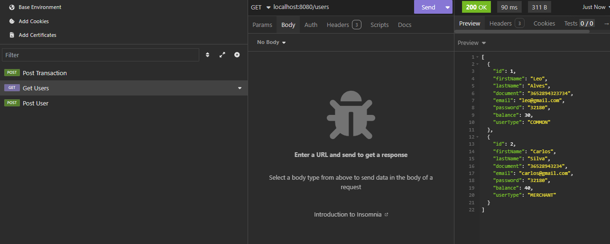
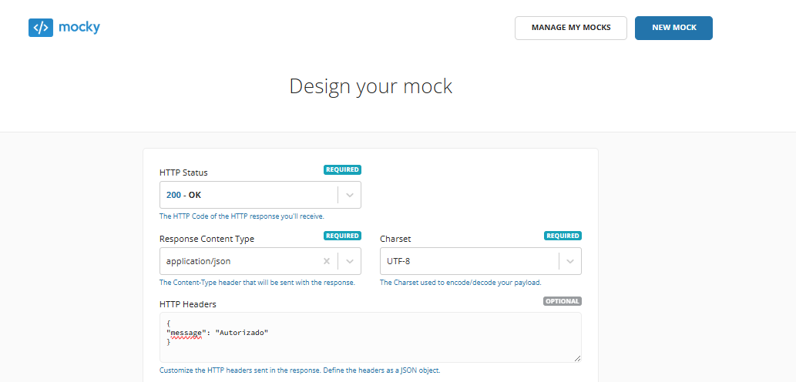

# Projeto de API de Transações Financeiras (Desafio de Vaga Backend - PicPay)



Este projeto é um DESAFIO de vaga para desenvolvedor BACKEND do PicPay. Trata-se de uma API RESTful desenvolvida com Java Spring Boot para simular transações financeiras entre usuários. A API permite a criação de usuários dos tipos lojista e comum, sendo que somente usuários comuns podem realizar transações para outros usuários, enquanto os usuários lojistas apenas podem receber transações. A aplicação inclui um serviço de autorização de transações e um sistema de notificação, proporcionando um fluxo completo de simulação de transações financeiras.

O H2 Database é utilizado para armazenar de forma temporária os dados dos usuários e transações. Sendo um banco de dados em memória, ele é ideal para desenvolvimento e testes, permitindo que as operações sejam realizadas rapidamente sem a necessidade de um banco de dados externo.

Para a autorização das transações, a API utiliza um serviço externo de autorização, que está sendo simulado com o Mocky. O Mocky é uma ferramenta que permite criar respostas simuladas para testes de integração, possibilitando que a API valide as transações antes de executá-las. Para fins de desenvolvimento, uma URL mockada do Mocky é configurada para simular a autorização das transações, mas ela pode ser substituída por um serviço real conforme necessário.


### Funcionalidades:

- **Criação de Usuários (POST):** Permite a criação de usuários dos tipos **lojista** (somente pode receber transações) e **comum** (pode realizar e receber transações).  
- **Transações (POST):** Permite realizar transferências de valores entre usuários comuns e/ou entre usuários comuns e lojistas, com validação da autorização antes de concluir a transação.  
- **Autorização Externa:** Utiliza um serviço externo (Mocky) para validar as transações antes de sua execução, garantindo que sejam realizadas de acordo com as regras predefinidas.  
- **Notificação (GET):** Após a transação, tanto o remetente quanto o destinatário recebem uma notificação sobre o status da transação realizada.  
- **Tratamento de Exceções:** Implementa tratamento de erros personalizados para garantir que falhas, como dados duplicados ou usuários não encontrados, sejam devidamente identificadas.

---

# 💻 Requisitos

- **Java** (versão 17 ou superior)
- **Maven** (gerenciamento de dependências e construção do projeto)
- **Banco de Dados H2** (armazenamento temporário de dados)
- **Mocky** (serviço de autorização de transações)

---

# ⬇️ Instalação do Projeto
## Primeiro você deve clonar o repositório

```bash
## Clone o repositório
https://github.com/LeoAlves02/picpay-transactions

## Acesse-o
cd picpay-transactions
```

Para instalar as dependências, execute o seguinte comando:

```bash
mvn install
```
Aqui está a explicação completa sobre como alterar a URL do Mocky no arquivo `application.properties`:

---

# 🚀 Configuração do Serviço de Autorização com Mocky



Durante o desenvolvimento, a API utiliza o **Mocky** para simular a autorização de transações. O Mocky permite criar respostas simuladas para testar a integração da API sem depender de um serviço externo real.

Para personalizar a URL do serviço de autorização, siga os passos abaixo:

1. **Acesse o site do Mocky**: Vá para [https://run.mocky.io/](https://run.mocky.io/) e clique em **Create your own Mock**.
2. **Configure a resposta**: Crie uma resposta personalizada com o conteúdo que deseja simular. Por exemplo, uma resposta que simula a autorização de uma transação.
3. **Copie a URL gerada**: Após configurar a resposta, o Mocky gerará uma URL única. Copie essa URL.
4. **Altere a URL no `application.properties`**: No seu projeto, localize o arquivo `src/main/resources/application.properties`. Encontre a linha com a URL do Mocky e substitua pela URL copiada do Mocky.

Exemplo da linha no `application.properties`:

```properties
api.mocky.url=https://run.mocky.io/v3/seu-endpoint-aqui
```

Substitua o valor da URL pelo novo link gerado pelo Mocky.


Agora, sempre que a API realizar uma transação, ela utilizará a URL configurada para simular a autorização. Isso permite testar a funcionalidade de transações sem a necessidade de um serviço de autorização real, facilitando o desenvolvimento até que você esteja pronto para integrar com um serviço externo real de autorização.

---

# 🚀 Como Executar o Projeto

Após configurar o projeto e as dependências, execute o projeto com o seguinte comando:

```bash
mvn spring-boot:run
```

Quando o servidor estiver em funcionamento, você pode começar criando os usuários. Envie um **POST request** para o endpoint `http://localhost:8080/api/users` com o corpo do request em JSON. Exemplo:

### Criar usuário Comum:

```json
{
  "firstName": "João", 
  "lastName": "Silva", 
  "document": "365289434",
  "email": "joaosilva@gmail.com", 
  "password": "Senha123",
  "userType": "COMMON", 
  "balance": 40
}
```

### Criar usuário Lojista:

```json
{
  "firstName": "Fernando", 
  "lastName": "Batista", 
  "document": "4327892034",
  "email": "fernandobatista@exemplo.com", 
  "password": "Senha123",
  "userType": "MERCHANT", 
  "balance": 500
}
```

Após criar os usuários, você pode testar a API enviando um **POST request** para o endpoint `http://localhost:8080/api/transactions` para realizar uma transação. Exemplo de JSON para a transação:

### Realizar transação:

```json
{
  "senderId": 1,
  "receiverId": 2,
  "value": 20.00
}
```

Isso acionará a criação de uma transação entre os usuários. Caso a transação seja autorizada, o saldo dos usuários será atualizado e ambos receberão uma notificação sobre o status da transação.
